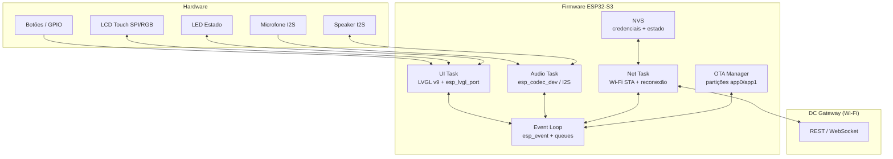

# Arquitetura de Software Mínima — Firmware ESP32-S3 (DC V1)

> Documento que define a **arquitetura de software mínima** do firmware da DC V1 para o **ESP32-S3**: interface **LVGL** + **Wi-Fi** + **áudio**, preparada para crescer (voz, IA, Spotify, agenda) sem refazer a base.

---

## 1. Objetivo e âmbito

O firmware do ESP32-S3 mantém-se **simples**: ele não sabe o que é Spotify, calendário ou IA. Apenas:

- **Entrada**: microfone, touch, botões
- **Processamento local**: interface, áudio, Wi-Fi, Bluetooth, wake word, estados
- **Saída**: LCD, speaker, LED

Tudo o resto (IA, música, agenda, chamadas) vive no **DC Gateway**, com quem o ESP32 comunica por Wi-Fi/API.

**Âmbito desta arquitetura mínima** (DC 0.1 + 0.2):
1. Boot estável e gestão de memória/PSRAM
2. Interface gráfica LVGL (Home, Menu, estados da DC)
3. Wi-Fi com credenciais persistidas (ESP-NVS) e reconexão
4. Áudio de saída (speaker) e captura (microfone) via I2S/`esp_codec_dev`
5. OTA com partition table a duas aplicações

## 2. Visão geral em camadas

```
┌─────────────────────────────────────────────────────────────┐
│                        APP (DC App)                        │
│   Home · Menu · Música · Agenda · Definições · Estados     │
├─────────────────────────────────────────────────────────────┤
│                      SERVIÇOS (Services)                   │
│   UI Manager · Audio Manager · Net Manager · OTA Manager   │
├─────────────────────────────────────────────────────────────┤
│                      DRIVERS (Componentes)                 │
│   esp_lvgl_port · esp_codec_dev · I2S · Wi-Fi · NVS · OTA   │
├─────────────────────────────────────────────────────────────┤
│                         HAL (Hardware)                     │
│   LCD (SPI/RGB) · Touch (I2C) · Codec Áudio · GPIO/LED     │
├─────────────────────────────────────────────────────────────┤
│                      ESP-IDF (RTOS + SDK)                  │
│   FreeRTOS · esp_event · esp_netif · drivers · NVS          │
└─────────────────────────────────────────────────────────────┘
```

**Regra de dependência**: cada camada só usa a camada abaixo. A `App` nunca chama o driver diretamente — passa sempre pelos `Services`.

## 3. Diagrama de blocos



## 4. Tarefas FreeRTOS (prioridades, stack, core)

A arquitetura mínima usa **4 tarefas de aplicação** + as tarefas do sistema ESP-IDF (Wi-Fi, TCP/IP, etc.). O LVGL **não** deve correr na mesma tarefa do áudio — o áudio é sensível a latência e o LVGL a bloqueios de I/O.

| Tarefa | Prioridade | Stack (bytes) | Core | Responsabilidade |
|---|---|---|---|---|
| `ui_task` | 5 | 8192 (PSRAM) | 1 | É dona do LVGL: `lv_timer_handler()`, eventos de touch, atualização do ecrã |
| `audio_task` | 8 | 4096 | 0 | Captura (mic) e reprodução (speaker) via I2S; fila de amostras |
| `net_task` | 6 | 4096 | 0 | Gestão de Wi-Fi (STA), reconexão, estado da ligação, eventos de rede |
| `ota_task` | 4 | 6144 | 1 | Descarrega e aplica OTA (partição inativa) |
| *(sistema)* | — | — | 0 | Wi-Fi driver, TCP/IP (lwIP), esp_event |

> **Nota**: prioridades e stacks são valores de partida — devem ser ajustados com `heap_caps_get_free_size()` e monitorização de stack (`uxTaskGetStackHighWaterMark`) no primeiro boot.

**Regra de ouro**: nunca chamar `lv_*` fora da `ui_task`; enviar mensagens por **queue** para a UI. Nunca bloquear a `audio_task` com I/O de rede.

## 5. Comunicação entre tarefas

Usa-se **`esp_event`** (event loop do ESP-IDF) + **FreeRTOS queues**:

```
Touch/UI ──► ui_task ──► queue_ui ◄── (eventos de outras tarefas)
Audio    ──► audio_task ──► queue_audio ◄── (comandos: play, stop, volume)
Net      ──► net_task ──► queue_net ◄── (pedidos de ligação)
```

Exemplos de eventos:

| Evento | Origem → Destino | Conteúdo |
|---|---|---|
| `EVT_WIFI_CONNECTED` | net → ui | actualiza ícone Wi-Fi no ecrã |
| `EVT_PLAY_TRACK` | ui → audio | comando de reprodução |
| `EVT_TOUCH` | touch → ui | coordenadas para LVGL |
| `EVT_OTA_READY` | net → ota | nova versão disponível |

## 6. Subsistema de áudio

Baseado no driver **`esp_codec_dev`** (componente oficial da Espressif) sobre **I2S** — suporta codec de saída (speaker) e captura de microfone pelo mesmo barramento.

```
Captura (mic):  I2S RX ─► ring buffer ─► (futuro: STT / upload p/ Gateway)
Reprodução:     (Gateway / ficheiro) ─► ring buffer ─► I2S TX ─► speaker
```

**Fluxo de voz (DC 0.3, preparado desde já):**

```
Microfone → I2S RX → audio_task → (STT no Gateway) → IA → TTS → audio_task → I2S TX → Speaker
```

- O `audio_task` mantém **ring buffers** de captura e reprodução (tamanho configurável, ex. 16–32 kB).
- O volume é controlado no codec (não no DSP do LVGL) para evitar saturação.
- A amostragem de partida: **16 kHz / 16 bit / mono** (suficiente para voz; música pode upgrade para 44.1 kHz estéreo).

## 7. Subsistema de interface (LVGL v9 + esp_lvgl_port)

- **LVGL v9** como motor gráfico.
- **`esp_lvgl_port`** (v2.x, componente oficial) faz a ponte LCD/touch → LVGL e suporta **double buffering** (2 frame buffers) para renderização fluida.
- **PSRAM**: os frame buffers grandes devem viver na PSRAM; o buffer de flush do LCD pode ficar na RAM interna para melhor desempenho.

```
LCD (SPI/RGB) ──► esp_lvgl_port ──► LVGL v9 ──► ui_task (lv_timer_handler)
Touch (I2C)   ──► esp_lvgl_port ──► input_dev
```

**Ecrãs mínimos da V1** (DC 0.2):
- `Home` (relógio, bateria, Wi-Fi, botão central da DC)
- `Menu` (Música, Agenda, Chamadas, Definições)
- `Now Playing` (capa, título/artista, ◀ ⏸ ▶, barra de progresso)
- `Definições` (Wi-Fi, volume, brilho, idioma)
- `Estados da DC` (a ouvir, a falar, a pensar — animações LVGL)

## 8. Subsistema de rede (Wi-Fi)

- Modo **STA** (station) com credenciais persistidas em **ESP-NVS**.
- Provisionamento inicial: **SoftAP** (ponto de acesso temporário para configuração) ou **BLE provisioning** (componente `wifi_prov`) — o utilizador introduz SSID/password uma vez.
- **Máquina de estados de conexão**:

```
        ┌──────────────┐
        ▼              │
   [DISCONNECTED]      │  falha / timeout
        │              │
        ▼              │
    [CONNECTING] ──────┘
        │ conectado
        ▼
    [CONNECTED] ────► [ONLINE] (Gateway alcançável)
        │
        ▼
   [RECONNECT] (backoff exponencial: 5s, 10s, 20s... máx 5 min)
```

- O `net_task` gere a reconexão automática e publica `EVT_WIFI_*` no event loop.
- A ligação ao **Gateway** é REST/WebSocket; a API base fica configurável (NVS ou compilada).

## 9. Gestão de memória / PSRAM

O ESP32-S3 tem **RAM interna limitada** (~512 kB) — a PSRAM é obrigatória para ecrãs grandes.

| Recurso | Onde alocar | Porquê |
|---|---|---|
| Frame buffers LVGL (double buffer) | **PSRAM** | 2 × (largura×altura×2 bytes) facilmente > RAM interna |
| Stack `ui_task` | **PSRAM** | 8 kB+ de stack de UI |
| Ring buffers de áudio | **RAM interna** | latência baixa, acesso frequente |
| Stack `audio_task` / `net_task` | **RAM interna** | tarefas críticas |
| Cache de imagens/ícones | **PSRAM** | `LV_MEM_CUSTOM` + heap PSRAM |

**Práticas**: ativar `CONFIG_SPIRAM=y`; usar `heap_caps_malloc(MALLOC_CAP_SPIRAM)` para buffers grandes; monitorizar heap com `esp_get_free_heap_size()` e `heap_caps_get_free_size(MALLOC_CAP_SPIRAM)`.

## 10. OTA e partition table

A DC precisa de atualizações sem cabo — a partition table usa **duas partições de aplicação** + **OTA data**:

```
# partitions.csv (mínima)
nvs,      data, nvs,     0x9000, 0x6000,
otadata,  data, ota,     0xf000, 0x2000,
phy_init, data, phy,     0x1000, 0x1000,
app0,     app,  ota_0,   0x20000, 0x300000,
app1,     app,  ota_1,   0x320000, 0x300000,
```

- **`otadata`** (0x2000 bytes) guarda qual a partição ativa.
- O `ota_task` descarrega a nova imagem para a partição **inativa** e faz `esp_ota_set_boot_partition()` + reinício.
- Rollback: se o novo firmware não arranca (watchdog), o bootloader volta à partição anterior.

## 11. Estrutura de pastas / componentes

```
firmware/
├── CMakeLists.txt
├── partitions.csv
├── sdkconfig.defaults
├── main/
│   ├── CMakeLists.txt
│   ├── app_main.c              # boot, arranque de tarefas
│   ├── app_config.h            # pinos, tamanhos, API do Gateway
│   ├── services/
│   │   ├── ui_manager.c/.h     # ecrãs LVGL, navegação, estados
│   │   ├── audio_manager.c/.h   # captura/reprodução via esp_codec_dev
│   │   ├── net_manager.c/.h     # Wi-Fi STA, reconexão, API Gateway
│   │   └── ota_manager.c/.h     # descarga e aplicação de OTA
│   └── hal/
│       ├── lcd_hal.c/.h         # init LCD + touch (SPI/I2C)
│       ├── audio_hal.c/.h       # init codec + I2S
│       └── gpio_hal.c/.h        # botões, LED
└── components/                  # dependências (idf_component.yml)
    └── (lvgl, esp_lvgl_port, esp_codec_dev, ...)
```

Dependências declaradas em `main/idf_component.yml` (componentes do **ESP Component Registry**):

```yaml
dependencies:
  lvgl/lvgl: "^9.2"
  espressif/esp_lvgl_port: "^2.9"
  espressif/esp_codec_dev: "^1.6"
  idf: "^5.3"
```

## 12. Configuração mínima (sdkconfig.defaults)

```ini
CONFIG_SPIRAM=y
CONFIG_SPIRAM_MODE_OCT=y
CONFIG_LV_MEM_CUSTOM=y
CONFIG_LV_COLOR_DEPTH_16=y
CONFIG_ESP_WIFI_STA_DISCONNECTED_PM_ENABLE=y
CONFIG_ESPTOOLPY_FLASHSIZE_8MB=y
```

## 13. Roadmap de implementação

| Fase | Conteúdo | Resultado |
|---|---|---|
| **0.1** | HAL (LCD, touch, codec, GPIO) + tarefas base | Cada periférico testado isoladamente |
| **0.2** | LVGL + ecrãs Home/Menu/Definições + estados | Interface navegável no touch |
| **0.3** | Áudio (reprodução + captura) + Wi-Fi + NVS | Toca som e liga à rede |
| **0.4** | Ligação ao Gateway (REST/WS) + OTA | Primeira versão "viva" |

> A arquitetura está preparada para **IoT (DC 2.0)** sem refazer: o `net_manager` ganha um cliente MQTT e o Gateway expõe `iot.turn_on(...)` — o firmware apenas recebe comandos por mais um canal.

---

## Referências

- ESP LVGL Adapter (`esp_lvgl_port`) — [docs.espressif.com](https://docs.espressif.com/projects/esp-iot-solution/en/latest/display/tools/esp_lvgl_adapter.html) e [ESP Component Registry](https://components.espressif.com/components/espressif/esp_lvgl_port)
- `esp_codec_dev` (áudio via I2S) — [ESP Component Registry](https://components.espressif.com/components/espressif/esp_codec_dev)
- I2S driver (ESP-IDF) — [docs.espressif.com](https://docs.espressif.com/projects/esp-idf/en/stable/esp32/api-reference/peripherals/i2s.html)
- FreeRTOS (IDF) — [docs.espressif.com](https://docs.espressif.com/projects/esp-idf/en/stable/esp32/api-reference/system/freertos.html)
- Wi-Fi Provisioning (NVS) — [docs.espressif.com](https://docs.espressif.com/projects/esp-idf/en/release-v4.3/esp32/api-reference/provisioning/wifi_provisioning.html)
- Partition Tables e OTA — [docs.espressif.com](https://docs.espressif.com/projects/esp-idf/en/stable/esp32/api-guides/partition-tables.html) e [OTA](https://docs.espressif.com/projects/esp-idf/en/stable/esp32/api-reference/system/ota.html)
