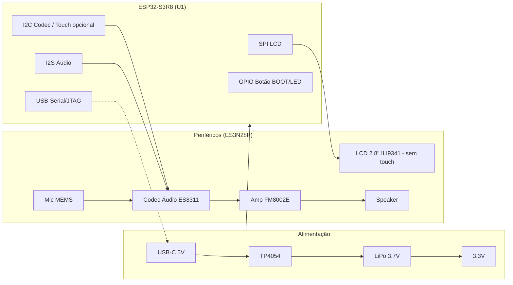

# Hardware da DC V1 — Lista de Componentes, Pinout e Ligações

> **Placa confirmada**: LCDWIKI **ES3N28P** — módulo 2.8" IPS ESP32-S3, variante **sem** touch capacitivo (a ES3C28P é a irmã com touch; ambas partilham o mesmo pinout físico). Pinout obtido do datasheet oficial LCDWIKI (CR2025-MI6875 / CR2025-MI6872) e cruzado com a BSP de referência da placa. Recomenda-se confirmar por continuidade antes do primeiro boot.

---

## 1. Lista de componentes (montados na ES3N28P)

| Ref | Componente | Qtd | Função | Estado |
|---|---|---|---|---|
| U1 | ESP32-S3R8 (8 MB OPI PSRAM) + 16 MB QSPI Flash externa | 1 | MCU principal, Wi-Fi 2.4G + BT 5.0 | confirmado |
| U2 | LCD IPS 2.8" 240×320, driver ILI9341V, SPI 4 fios | 1 | Ecrã da interface | confirmado |
| U3 | Controlador de touch FT6336G (I2C) | 0 | **Não montado nesta variante** (só na ES3C28P) | confirmado (ausente) |
| U4 | Codec de áudio ES8311 (I2C 0x18 + I2S) | 1 | ADC microfone + DAC speaker | confirmado |
| U5 | Amplificador classe D FM8002E | 1 | Amplificação do speaker (1.5W/8Ω, 2W/4Ω) | confirmado |
| MIC1 | Microfone MEMS (downward, via codec) | 1 | Captura de voz | confirmado |
| SPK1 | Conector para speaker externo | 1 | Saída de áudio | confirmado |
| U6 | TP4054 | 1 | Carga da bateria (máx. 500 mA) | confirmado |
| U7 | ME6217C33M5G (LDO 5V→3.3V, x2: áudio + geral) | 2 | Alimentação do sistema | confirmado |
| BT1 | Bateria LiPo 3.7 V (conector 2P 1.25mm) | 1 | Alimentação portátil | a acrescentar pelo utilizador |
| SW1 | Botão BOOT (IO0) | 1 | Download mode / navegação da UI (sem touch) | confirmado |
| SW2 | Botão RESET | 1 | Reset físico | confirmado |
| LED1 | RGB LED (WS2812B, IC interno) | 1 | Indicador de estado da DC | confirmado |
| SD1 | Slot MicroSD (SDIO 4 bits) | 1 | Armazenamento (fontes, imagens, áudio) | confirmado |
| J1 | Conector USB-C | 1 | Alimentação + programação | confirmado |

## 2. Pinout confirmado — ES3N28P

> **Pinos reservados que NÃO são usados em funções de periférico**: GPIO26–GPIO32 (flash/PSRAM internos), GPIO19/GPIO20 (USB-Serial/JTAG nativo).

### Display LCD (SPI, ILI9341V)

| Pino MCU | Sinal | Notas |
|---|---|---|
| GPIO10 | LCD_CS | chip select (ativo baixo) |
| GPIO46 | LCD_DC | data/command |
| GPIO12 | LCD_SCK | relógio SPI |
| GPIO11 | LCD_MOSI | dados SPI |
| GPIO13 | LCD_MISO | dados SPI (leitura, raramente usado) |
| RST | LCD_RST | partilhado com o reset do ESP32-S3 (sem GPIO dedicado) |
| GPIO45 | LCD_BL | backlight, controlado por PWM |

### I2C partilhado (touch se existisse + codec de áudio)

| Pino MCU | Sinal | Notas |
|---|---|---|
| GPIO16 | I2C_SDA | barramento partilhado: codec ES8311 (0x18); touch FT6336G (0x38) só na ES3C28P |
| GPIO15 | I2C_SCL | idem |
| GPIO18 | TOUCH_RST | **não usado na ES3N28P** (sem touch) |
| GPIO17 | TOUCH_INT | **não usado na ES3N28P** (sem touch) |

### Áudio (I2S + amplificador)

| Pino MCU | Sinal | Notas |
|---|---|---|
| GPIO1 | AMP_EN | enable do FM8002E, ativo baixo |
| GPIO4 | I2S_MCLK | master clock |
| GPIO5 | I2S_BCLK | bit clock |
| GPIO6 | I2S_DOUT | ESP32-S3 → codec (para o speaker) |
| GPIO7 | I2S_LRCK | word select |
| GPIO8 | I2S_DIN | codec → ESP32-S3 (do microfone) |

### MicroSD (SDIO 4 bits)

| Pino MCU | Sinal |
|---|---|
| GPIO38 | SD_CLK |
| GPIO40 | SD_CMD |
| GPIO39 | SD_D0 |
| GPIO41 | SD_D1 |
| GPIO48 | SD_D2 |
| GPIO47 | SD_D3 |

### Botões, LED e bateria

| Pino MCU | Sinal | Notas |
|---|---|---|
| GPIO0 | BTN_BOOT | download mode no boot; botão de navegação da UI depois de arrancar (sem touch, é o único input físico da V1) |
| GPIO42 | LED_RGB | WS2812B, 1 pino de dados |
| GPIO9 | BAT_ADC | tensão da bateria via divisor resistivo (÷2) |
| GPIO2 / GPIO3 / GPIO14 / GPIO21 | EXPANSÃO | 4 IOs livres nos conectores de expansão — **a confirmar** layout de botões físicos extra (ex. vol+/vol−/central) |

### Debug e programação

| Pino MCU | Sinal | Notas |
|---|---|---|
| GPIO44 | UART0_TX | console/debug |
| GPIO43 | UART0_RX | console/debug |
| GPIO19 / GPIO20 | USB_D− / USB_D+ | USB-Serial/JTAG nativo, também usado para flashing pelo Type-C |

**Verificação de pinout**: nenhum GPIO aparece atribuído duas vezes; os pinos reservados (flash/PSRAM interno, USB nativo) não são usados em funções de periférico. Pinout também disponível em código, com comentários, em [`firmware/main/app_config.h`](../firmware/main/app_config.h).

## 3. Alimentação

```
USB-C (5 V)
   │
   ▼
[U6 TP4054] ──► [BT1 LiPo 3.7 V]
                    │
                    ▼
              [U7 Regulador 3.3 V] (x2: geral + áudio)
                    │
        ┌───────────┼───────────────┐
        ▼           ▼               ▼
   ESP32-S3      LCD 3.3V        Codec 3.3V
   (3.3V)        (backlight)     + Amp (speaker)
```

- **USB-C (5 V)** alimenta o carregador TP4054 e a carga da bateria.
- **Bateria LiPo 3.7 V** alimenta o regulador 3.3 V.
- **3.3 V** alimenta o ESP32-S3, LCD, codec e amplificador.
- O **backlight** do LCD pode ser ligado/desligado por PWM (GPIO45) para poupar energia.

## 4. Diagrama de blocos



## 5. Notas e próximos passos

1. ~~Confirmar o hardware real~~ — feito: placa **ES3N28P** (sem touch), pinout confirmado nesta página e em `firmware/main/app_config.h`.
2. **Decidir o layout de botões externos** (vol+/vol−/central) nos 4 IOs de expansão (GPIO2/3/14/21) — hoje a navegação da UI usa só o botão BOOT.
3. Se for necessário touch no futuro, trocar para a variante **ES3C28P** (mesmo pinout físico + FT6336G em I2C) — o firmware já isola isto com `DC_BOARD_HAS_TOUCH` em `app_config.h`.
4. Testar cada periférico individualmente (DC 0.1 — LCD e botão já implementados) antes de avançar para áudio/Wi-Fi (DC 0.3).
