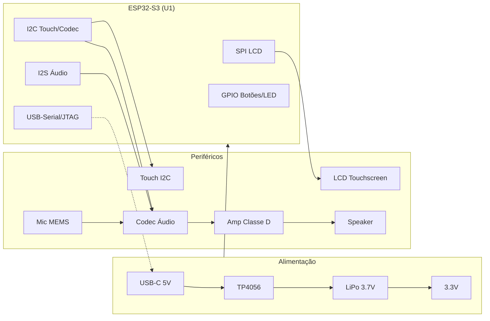

# Hardware da DC V1 — Lista de Componentes, Pinout e Ligações

> **Nota importante**: o repositório ainda não define um pinout oficial. As tabelas abaixo são uma **proposta inicial de referência** para arrancar o DC 0.1 — todos os componentes e pinos estão marcados como **"a confirmar"** até o hardware real ser escolhido e validado.

---

## 1. Lista de componentes

| Ref | Componente | Qtd | Função | Estado |
|---|---|---|---|---|
| U1 | Módulo ESP32-S3 (ex. WROOM-1 N16R8 — 16 MB flash / 8 MB PSRAM) | 1 | MCU principal, Wi-Fi + Bluetooth | a confirmar |
| U2 | LCD TFT touchscreen (ex. 3.5" 480×320, interface SPI) | 1 | Ecrã da interface | a confirmar |
| U3 | Controlador de touch (ex. FT6236 / CST816S, I2C) | 1 | Entrada touch | a confirmar |
| U4 | Codec de áudio (ex. ES8311 / ES8316, I2S + I2C) | 1 | ADC microfone + DAC speaker | a confirmar |
| U5 | Amplificador classe D (ex. MAX98357A) | 1 | Amplificação do speaker | a confirmar |
| MIC1 | Microfone MEMS (analógico via codec) | 1 | Captura de voz | a confirmar |
| SPK1 | Speaker 3 W / 8 Ω | 1 | Saída de áudio | a confirmar |
| U6 | Carregador LiPo (ex. TP4056) | 1 | Carga da bateria | a confirmar |
| U7 | Regulador 3.3 V (buck/LDO) | 1 | Alimentação do sistema | a confirmar |
| BT1 | Bateria LiPo 3.7 V | 1 | Alimentação portátil | a confirmar |
| SW1–SW3 | Botões (central, volume +, volume −) | 3 | Controlo físico | a confirmar |
| LED1 | LED de estado (ou RGB) | 1 | Indicador de estado da DC | a confirmar |
| J1 | Conector USB-C | 1 | Alimentação + programação | a confirmar |

## 2. Pinout (proposta inicial — a confirmar)

> **Pinos reservados que NÃO são usados**: GPIO0, GPIO3, GPIO45, GPIO46 (strapping), GPIO26–GPIO32 (SPI flash), GPIO19/20 (USB).

### Display LCD (SPI)

| Pino MCU | Sinal | Periférico | Notas |
|---|---|---|---|
| GPIO12 | LCD_SCLK | LCD | relógio SPI |
| GPIO11 | LCD_MOSI | LCD | dados SPI |
| GPIO10 | LCD_CS | LCD | chip select |
| GPIO9 | LCD_DC | LCD | data/command |
| GPIO8 | LCD_RST | LCD | reset |
| GPIO7 | LCD_BL | LCD | backlight (PWM) |

### Touch (I2C)

| Pino MCU | Sinal | Periférico | Notas |
|---|---|---|---|
| GPIO6 | I2C_SDA | Touch + codec (barramento partilhado) | dados I2C |
| GPIO5 | I2C_SCL | Touch + codec (barramento partilhado) | relógio I2C |
| GPIO4 | TOUCH_INT | Touch | interrupção |
| GPIO15 | TOUCH_RST | Touch | reset |

### Áudio (I2S + controlo I2C)

| Pino MCU | Sinal | Periférico | Notas |
|---|---|---|---|
| GPIO16 | I2S_MCLK | Codec | master clock |
| GPIO17 | I2S_BCLK | Codec | bit clock |
| GPIO18 | I2S_WS | Codec | word select (LRCK) |
| GPIO21 | I2S_DOUT | Codec | TX (ESP32 → codec) |
| GPIO14 | I2S_DIN | Codec | RX (codec → ESP32) |

### Botões e LED

| Pino MCU | Sinal | Periférico | Notas |
|---|---|---|---|
| GPIO1 | BTN_WAKE | Botão central | wake / "Olá DC" |
| GPIO2 | BTN_VOL_UP | Botão volume + | |
| GPIO13 | BTN_VOL_DOWN | Botão volume − | |
| GPIO48 | LED_STATUS | LED de estado | |

### Debug e programação

| Pino MCU | Sinal | Periférico | Notas |
|---|---|---|---|
| GPIO43 | UART0_TX | Console | debug |
| GPIO44 | UART0_RX | Console | debug |
| GPIO19 / GPIO20 | USB_D− / USB_D+ | USB-Serial/JTAG | programação |

**Verificação de pinout**: nenhum GPIO aparece atribuído duas vezes; os pinos reservados (strapping, flash, USB) não são usados em funções de periférico.

## 3. Alimentação

```
USB-C (5 V)
   │
   ▼
[U6 TP4056] ──► [BT1 LiPo 3.7 V]
                    │
                    ▼
              [U7 Regulador 3.3 V]
                    │
        ┌───────────┼───────────────┐
        ▼           ▼               ▼
   ESP32-S3      LCD 3.3V        Codec 3.3V
   (3.3V)        (backlight)     + Amp (speaker)
```

- **USB-C (5 V)** alimenta o carregador TP4056 e a carga da bateria.
- **Bateria LiPo 3.7 V** alimenta o regulador 3.3 V.
- **3.3 V** alimenta o ESP32-S3, LCD, codec e amplificador.
- O **backlight** do LCD pode ser ligado/desligado por PWM (GPIO7) para poupar energia.

## 4. Diagrama de blocos



## 5. Notas e próximos passos

1. **Confirmar o hardware real** (módulo ESP32-S3, LCD, codec, amplificador, bateria) — os pinos acima são uma proposta de referência.
2. **Ajustar o pinout** ao módulo/board escolhido e validar no `app_config.h` do firmware.
3. **Gerar o esquema elétrico** (KiCad) e o PCB a partir da lista de componentes.
4. Testar cada periférico individualmente (DC 0.1) antes de avançar para a interface LVGL (DC 0.2).
